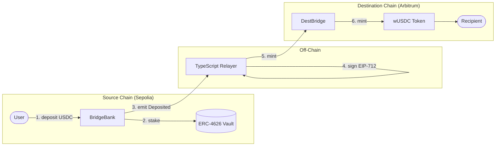

# Yield-Bearing Bridge

A cross-chain token bridge that **earns yield** on deposited assets while tokens are in transit. Built with Solidity 0.8.33 and a TypeScript relayer.

## Architecture



## Key Features

**Yield Generation** -Deposited tokens earn yield in ERC-4626 vault while bridging  
**EIP-712 Signatures** -Type-safe, human-readable signing for relayer authorization  
**Multi-Chain Support** -Registry pattern for adding/removing source and destination chains
**Replay Protection** -Nonce-based system prevents double-spending attacks  
**Pausable Operations** -Emergency pause mechanism on both chains  
**Slippage Protection** -Minimum output checks on refunds

### Smart Contracts

- **Solidity 0.8.33** - Latest stable compiler
- **Foundry** - Development framework (Forge, Cast, Anvil)
- **OpenZeppelin** - Access control (Ownable, Pausable)
- **Solmate** - Gas-optimized ERC20, ERC4626, SafeTransferLib

### Relayer

- **TypeScript** + **Viem** - Type-safe Ethereum interactions
- **EIP-712** - Structured data signing
- **Foundry Keystore** - Secure key management (no raw private keys)

### Testing

- **Forge Tests** - Unit, integration, and fuzz testing
- **Slither** - Static analysis for security vulnerabilities

## Project Structure

```
├── src/
│   ├── source/
│   │   ├── BridgeBank.sol      # Accepts deposits, routes to vault
│   │   └── VaultAdapter.sol    # ERC-4626 vault integration
│   ├── destination/
│   │   ├── DestBridge.sol      # Verifies signatures, mints tokens
│   │   └── BridgedToken.sol    # Wrapped token (wUSDC)
│   ├── libraries/
│   │   ├── BridgeTypes.sol     # Shared structs and errors
│   │   └── SignatureUtils.sol  # EIP-712 signature verification
│   └── interfaces/             # Contract interfaces
├── relayer/                    # TypeScript off-chain service
├── test/                       # Unit, integration, fuzz tests
├── script/                     # Deployment scripts
└── deployments/                # Deployed contract addresses
```

## Quick Start

###Prerequisites

- Foundry
- Node.js 18+

###Run Relayer

```bash
cd relayer
npm install
npm run start
```
